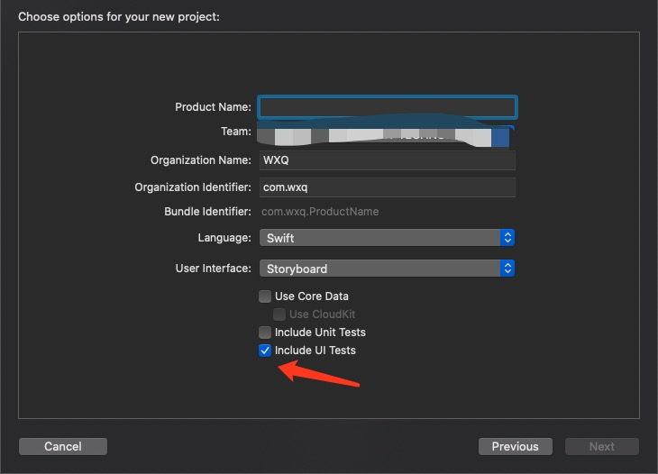
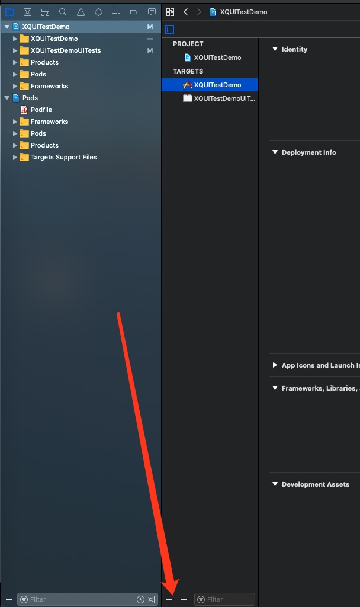
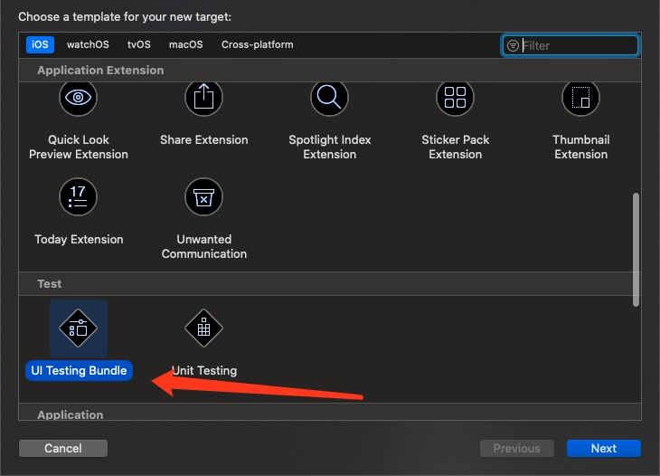
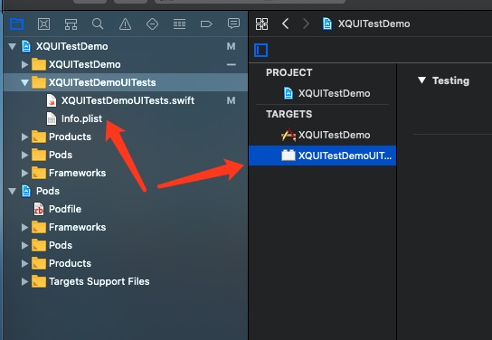
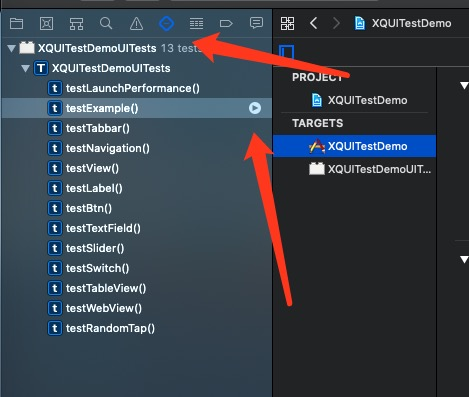
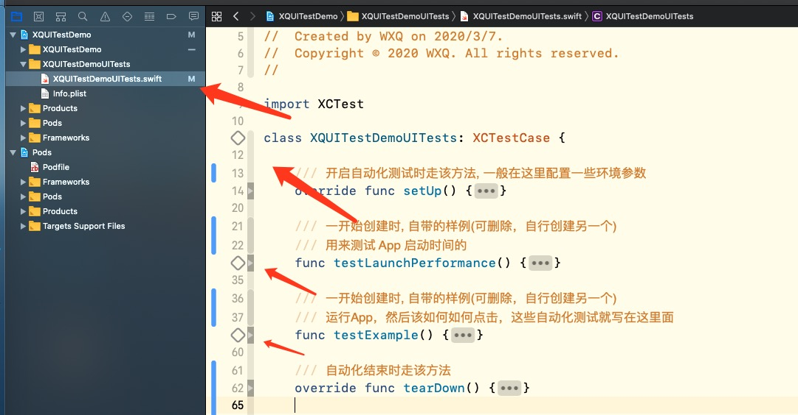
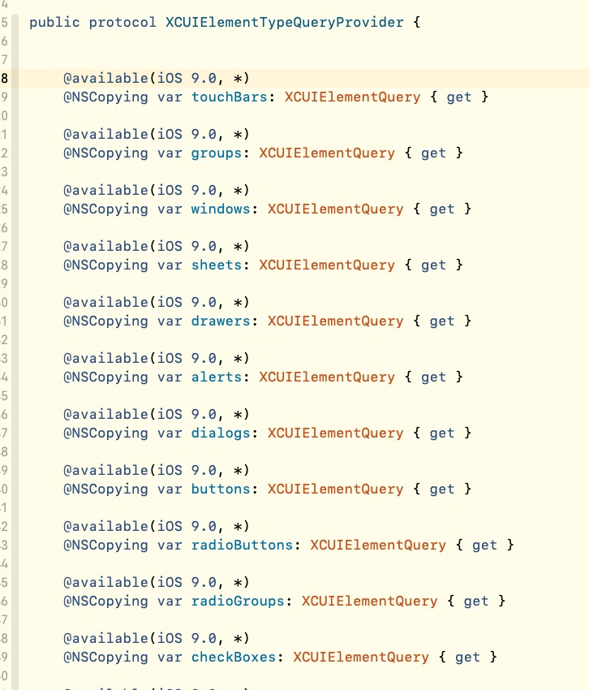
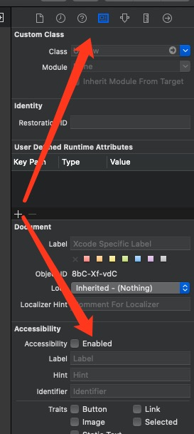

- [前言](#%e5%89%8d%e8%a8%80)
- [如何创建自动化测试](#%e5%a6%82%e4%bd%95%e5%88%9b%e5%bb%ba%e8%87%aa%e5%8a%a8%e5%8c%96%e6%b5%8b%e8%af%95)
- [创建好的自动化测试在哪里?](#%e5%88%9b%e5%bb%ba%e5%a5%bd%e7%9a%84%e8%87%aa%e5%8a%a8%e5%8c%96%e6%b5%8b%e8%af%95%e5%9c%a8%e5%93%aa%e9%87%8c)
- [如何使用自动化测试](#%e5%a6%82%e4%bd%95%e4%bd%bf%e7%94%a8%e8%87%aa%e5%8a%a8%e5%8c%96%e6%b5%8b%e8%af%95)
- [生命周期(运行流程)](#%e7%94%9f%e5%91%bd%e5%91%a8%e6%9c%9f%e8%bf%90%e8%a1%8c%e6%b5%81%e7%a8%8b)
- [具体使用介绍](#%e5%85%b7%e4%bd%93%e4%bd%bf%e7%94%a8%e4%bb%8b%e7%bb%8d)
  - [初始化 App](#%e5%88%9d%e5%a7%8b%e5%8c%96-app)
  - [获取元素](#%e8%8e%b7%e5%8f%96%e5%85%83%e7%b4%a0)
    - [根据类型取元素](#%e6%a0%b9%e6%8d%ae%e7%b1%bb%e5%9e%8b%e5%8f%96%e5%85%83%e7%b4%a0)
    - [根据 label 取元素](#%e6%a0%b9%e6%8d%ae-label-%e5%8f%96%e5%85%83%e7%b4%a0)
    - [根据下标取元素](#%e6%a0%b9%e6%8d%ae%e4%b8%8b%e6%a0%87%e5%8f%96%e5%85%83%e7%b4%a0)
    - [根据 identifier 取元素](#%e6%a0%b9%e6%8d%ae-identifier-%e5%8f%96%e5%85%83%e7%b4%a0)
  - [对元素的操作](#%e5%af%b9%e5%85%83%e7%b4%a0%e7%9a%84%e6%93%8d%e4%bd%9c)
    - [点击](#%e7%82%b9%e5%87%bb)
    - [双击](#%e5%8f%8c%e5%87%bb)
    - [长按](#%e9%95%bf%e6%8c%89)
    - [滑动](#%e6%bb%91%e5%8a%a8)
    - [捏合](#%e6%8d%8f%e5%90%88)
    - [旋转](#%e6%97%8b%e8%bd%ac)
- [实际用例](#%e5%ae%9e%e9%99%85%e7%94%a8%e4%be%8b)
  - [具体点击 UITableView 某一行](#%e5%85%b7%e4%bd%93%e7%82%b9%e5%87%bb-uitableview-%e6%9f%90%e4%b8%80%e8%a1%8c)
  - [直接打开其他 App](#%e7%9b%b4%e6%8e%a5%e6%89%93%e5%bc%80%e5%85%b6%e4%bb%96-app)
  - [系统桌面 App(springboard)](#%e7%b3%bb%e7%bb%9f%e6%a1%8c%e9%9d%a2-appspringboard)
  - [申请系统权限, 点击系统权限弹框(例如通知权限)](#%e7%94%b3%e8%af%b7%e7%b3%bb%e7%bb%9f%e6%9d%83%e9%99%90-%e7%82%b9%e5%87%bb%e7%b3%bb%e7%bb%9f%e6%9d%83%e9%99%90%e5%bc%b9%e6%a1%86%e4%be%8b%e5%a6%82%e9%80%9a%e7%9f%a5%e6%9d%83%e9%99%90)
  - [Home键](#home%e9%94%ae)
  - [系统音量按键](#%e7%b3%bb%e7%bb%9f%e9%9f%b3%e9%87%8f%e6%8c%89%e9%94%ae)
  - [Siri](#siri)
  - [设备转方向](#%e8%ae%be%e5%a4%87%e8%bd%ac%e6%96%b9%e5%90%91)
- [项目地址](#%e9%a1%b9%e7%9b%ae%e5%9c%b0%e5%9d%80)

# 前言

最近正在学习 iOS 自动化测试(系统自带的 XCTest), 就总结一下自动化测试一些知识.  

# 如何创建自动化测试

就不介绍什么是自动化测试了，直接开搞

这里分两种情况

1. 刚新建项目

创建项目时, 勾上 Include UI Tests 即可




2. 已有了项目，却没有自动化测试

其实就是添加 target  
我们点击 '+' 号, 



选择 UI Testing Bundle




# 创建好的自动化测试在哪里?

创建好之后, 是在该目录下(看图), 默认名称是 项目名 + UITests  
看到这里, 写过 app extension 的老哥应该都明白了, 其实这个自动化测试就是一个 app extension 来的, 我们可以随意删除和创建, 甚至创建多个都是没问题的  




# 如何使用自动化测试

这里一般有两种使用法

1. 在 Show the Test Navigator 中使用

如图, 放鼠标到, 放在函数上, 例如 testExample()  
这时我们就能看到右边有个播放的小箭头, 点击这个小箭头, 我们就开始运行这个 testExample() 函数了  
如果运行大写 T(XQUITestDemoUITests), 就是运行这个测试模块中所有函数的意思  
运行自动化测试, 和运行项目一样的, 可以先选择设备, 就是选择真机或者某个模拟器  

> 刚创建时, 只有 testLaunchPerformance() 和 testExample() 两个函数  
> 其他函数是我后面写的  




2. 在 UITest 模块的 .swift 文件里面选择运行

上面的 testExample() 这些函数, 其实就是关联这个文件里面的函数
我们点开 UITest 模块的 .swift 文件(如下图), 就一切明了了



代码行数那里的四边形, 点击效果和上面说的一样, 就是运行自动化测试  
点击 class 旁边的运行, 是运行整个类里面所有函数的(和上面说的运行整个测试模块一样)

> 注意! 能单独执行的函数一定要 test 开头(就是旁边有四边形的函数)
> 就比如 testA() 这个就是可以的.  methodA() 旁边就没有四边形.

# 生命周期(运行流程)

周期如下 

1. setUp()
2. 自定义执行的函数
3. tearDown()


这里有个点, 要注意一下, 比如你当前测试模块里面有 testA(), testB() 两个函数.  
然后你直接点击运行整个测试模块, 他执行的顺序是.  

1. setUp()
2. testA()
3. tearDown()

然后再执行

1. setUp()
2. testB()
3. tearDown()

就是你会看到APP启动和关闭了两次.  

# 具体使用介绍


## 初始化 App 

```swift
// 初始化 XCUIApplication
let app = XCUIApplication()
// 启动app 
app.launch()

// 默认不填 bundleIdentifier, 就会初始化当前项目APP
// 如果是想搞其他APP, 可传入 bundleIdentifier 初始化, 就可获得其实例
let sefariApp = XCUIApplication.init(bundleIdentifier: "com.apple.mobilesafari")
```

注意, 以下文章出现 app 的代码, 都是指代 let app = XCUIApplication() 这个

## 获取元素

这里我就举例几种常用的就行, 其他的, 大家可自行研究

### 根据类型取元素

可直接查看系统 XCUIElementTypeQueryProvider



比如这样就能取得该 app 下面所有的 button  

```swift
app.buttons
```

但取到 XCUIElementQuery, 还不能直接用   
这个时候我们取到具体某个元素才行  

为了比较好明白, 这里我举一个例子, UI是这样  


以下就是 print(app.debugDescription) 输出的数据    
这里再啰嗦一下, debugDescription 属性对于获取元素层级来说挺舒服的, 我们要记得常用 debugDescription  

```
 →Application, 0x2819e7720, pid: 4843, label: 'XQUITestDemo'
    Window (Main), 0x2819e78e0, {{0.0, 0.0}, {375.0, 667.0}}
      Other, 0x2819e79c0, {{0.0, 0.0}, {375.0, 667.0}}
        Other, 0x2819e7aa0, {{0.0, 0.0}, {375.0, 667.0}}
          Other, 0x2819e7b80, {{0.0, 0.0}, {375.0, 667.0}}
            Other, 0x2819e7c60, {{0.0, 0.0}, {375.0, 667.0}}
              Other, 0x2819e7d40, {{0.0, 0.0}, {375.0, 667.0}}
                Other, 0x2819e7e20, {{0.0, 0.0}, {375.0, 667.0}}
                  NavigationBar, 0x2819e7f00, {{0.0, 20.0}, {375.0, 44.0}}, identifier: '我的'
                    StaticText, 0x2819e8000, {{170.0, 32.0}, {35.0, 20.5}}, label: '我的'
                  Other, 0x2819e80e0, {{0.0, 0.0}, {375.0, 667.0}}
                    Other, 0x2819e81c0, {{0.0, 0.0}, {375.0, 667.0}}
                      Other, 0x2819e82a0, {{0.0, 64.0}, {375.0, 603.0}}
                        Button, 0x280c8eae0, {{30.0, 214.0}, {60.0, 60.0}}, identifier: 'touchMe', label: '点我'
                          StaticText, 0x2819e8460, {{41.5, 233.0}, {37.0, 22.0}}, label: '点我'
            TabBar, 0x2819e8540, {{0.0, 618.0}, {375.0, 49.0}}
              Button, 0x2819e8620, {{2.0, 619.0}, {184.0, 48.0}}, label: '首页'
              Button, 0x2819e1b20, {{190.0, 619.0}, {183.0, 48.0}}, label: '我的', Selected
      Other, 0x2819e1a40, {{0.0, 0.0}, {375.0, 667.0}}, Disabled
        Other, 0x2819e0b60, {{0.0, 0.0}, {375.0, 667.0}}, identifier: 'SVProgressHUD'
    Window, 0x2819e1ce0, {{0.0, 0.0}, {375.0, 667.0}}
      Other, 0x2819e1f80, {{0.0, 0.0}, {375.0, 667.0}}
        Other, 0x2819e2060, {{0.0, 0.0}, {375.0, 667.0}}
```


> 注意, Other 对应的是 UIView

我们现在要点击 tabbar 首页这个按钮, 跳转到首页  
那么该怎么做呢? 很简单, 代码就两句  

```swift
// 取元素
let homePageBtn = app.tabBars.buttons["首页"]
// 点击元素
homePageBtn.tap()
```

这里我解析一下第一句取元素

app.tabBars 取到的是以下数据

```
TabBar, 0x2835c3800, {{0.0, 618.0}, {375.0, 49.0}}
    Button, 0x2835c38e0, {{2.0, 619.0}, {184.0, 48.0}}, label: '首页'
    Button, 0x2835c39c0, {{190.0, 619.0}, {183.0, 48.0}}, label: '我的', Selected
```

然后 app.tabBars.buttons 取到的是

```
Button, 0x2835c38e0, {{2.0, 619.0}, {184.0, 48.0}}, label: '首页'
Button, 0x2835c39c0, {{190.0, 619.0}, {183.0, 48.0}}, label: '我的', Selected
```

这个时候, 我们根据类型取元素, 就已经取到最后了  
想取首页按钮的话, 有几种方法, 请继续往下看  

### 根据 label 取元素

根据 label 来获取 button

```swift
app.tabBars.buttons["首页"]
```

当然, 按照当前这个UI, 最简单就是 app.buttons["首页"]   
但是为了能够更准确的取到某个元素, 最好不要吝啬一点代码

### 根据下标取元素

因为打印的数据, 里面的元素是有序的. 那么我们也可以通过下标来获取元素  

```swift
// 传入具体的下标, 取出按钮
app.tabBars.buttons.element(boundBy: 0)

// 当然, 也有类似数组一样取法, 取第一个
app.windows.tabBars.firstMatch
```


### 根据 identifier 取元素

不过你要提前在项目的代码, 或者 xib 中设置好 identifier 才行

```swift
// 这里取的不是 tabbar 的 首页按钮, 是那个黄色按钮
app.tabBars.element(matching: .button, identifier: "touchMe")
```


* 在代码中设置


accessibilityIdentifier 就是设置自动化测试时的 identifier

```swift
let btn = UIButton()
btn.frame = CGRect.init(x: 30, y: 150, width: 60, height: 60)
btn.setTitle("点我", for: .normal)
btn.backgroundColor = UIColor.orange
btn.accessibilityIdentifier = "touchMe"
```


* xib 或者 storyboard 中设置





## 对元素的操作

以下 button 就代表是一个按钮元素( XCUIElement类 )

### 点击

```swift
button.tap()
```

### 双击

```swift
button.doubleTap()
```

### 长按

```swift
// 长按三秒
button.press(forDuration: 3)
```

### 滑动

```swift
// 上扫
button.swipeUp()

// 下扫
button.swipeDown()

// 左扫
button.swipeLeft()

// 右扫
button.swipeRight()

```

### 捏合

```swift
button.pinch(withScale: 1.5, velocity: 1)
```

### 旋转

```swift
button.rotate(0.5, withVelocity: 1)
```


# 实际用例

这里举例一些我学习的时候, 搜了挺久, 都没搜到的实际用例吧  
这些用例我都放在了 [项目](https://github.com/SyKingW/XQUITestDemo) 里面，有兴趣的，可直接去下载 [项目](https://github.com/SyKingW/XQUITestDemo) 运行一下


## 具体点击 UITableView 某一行

示例 UI 如下


打印 app.debugDescription 数据如下

```
 →Application, 0x2838da060, pid: 1007, label: 'XQUITestDemo'
    Window (Main), 0x2838db560, {{0.0, 0.0}, {375.0, 667.0}}
      Other, 0x2838db640, {{0.0, 0.0}, {375.0, 667.0}}
        Other, 0x2838db720, {{0.0, 0.0}, {375.0, 667.0}}
          Other, 0x2838db800, {{0.0, 0.0}, {375.0, 667.0}}
            Other, 0x2838db8e0, {{0.0, 0.0}, {375.0, 667.0}}
              Other, 0x2838db9c0, {{0.0, 0.0}, {375.0, 667.0}}
                Other, 0x2838dbaa0, {{0.0, 0.0}, {375.0, 667.0}}
                  NavigationBar, 0x2838dbb80, {{0.0, 20.0}, {375.0, 44.0}}, identifier: 'TableView'
                    Button, 0x2838dbc60, {{0.0, 20.0}, {62.0, 44.0}}, label: '首页'
                    StaticText, 0x2838dbd40, {{147.0, 32.0}, {81.0, 20.5}}, label: 'TableView'
                  Other, 0x2838dbe20, {{0.0, 0.0}, {375.0, 667.0}}
                    Other, 0x2838dbf00, {{0.0, 0.0}, {375.0, 667.0}}
                      Other, 0x2838de760, {{0.0, 64.0}, {375.0, 603.0}}
                        Table, 0x2838debc0, {{0.0, 64.0}, {375.0, 611.0}}
                          Cell, 0x2838dea00, {{0.0, 64.0}, {375.0, 43.5}}
                            Image, 0x2838d0000, {{15.0, 73.5}, {24.0, 24.0}}
                            StaticText, 0x2838d00e0, {{54.0, 64.0}, {306.0, 43.5}}, label: '测试: 0'
                            Other, 0x2838d01c0, {{54.0, 107.0}, {321.0, 0.5}}
                            Button, 0x2838d02a0, {{281.0, 69.0}, {74.0, 34.0}}, label: '我是按钮'
                              StaticText, 0x2838d0380, {{281.0, 75.0}, {74.0, 22.0}}, label: '我是按钮'
                          Cell, 0x2838d0460, {{0.0, 107.5}, {375.0, 43.5}}
                            Image, 0x2838d0540, {{15.0, 117.0}, {24.0, 24.0}}
                            StaticText, 0x2838d0620, {{54.0, 107.5}, {306.0, 43.5}}, label: '测试: 1'
                            Other, 0x2838d0700, {{54.0, 150.5}, {321.0, 0.5}}
                            Button, 0x2838d07e0, {{281.0, 112.5}, {74.0, 34.0}}, label: '我是按钮'
                              StaticText, 0x2838d08c0, {{281.0, 118.5}, {74.0, 22.0}}, label: '我是按钮'
                          ...后面 cell 就省略了, 都是一样的数据格式
            TabBar, 0x2838f0fc0, {{0.0, 618.0}, {375.0, 49.0}}
              Button, 0x2838f10a0, {{2.0, 619.0}, {184.0, 48.0}}, label: '首页', Selected
              Button, 0x2838f1180, {{190.0, 619.0}, {183.0, 48.0}}, label: '我的'
```

其实逻辑挺简单, 就是找出 cell, 然后并且点击而已  
其实最关键的字段是 ==isHittable==, 请看以下代码, 虽然有点长. 不过请耐心看完    

```swift


class XQUITestDemoUITests: XCTestCase {

  /// 测试 tableView
  func testTableView() {

    // 初始化, 并打开APP
    let app = XCUIApplication()
    app.launch()

    // 读取 tableView 元素
    let tables = app.tables.firstMatch

    // 获取下标 30 的 cell
    let cell = tables.cells.element(boundBy: 30)
    // 调用封装的方法, 滚动到该 cell
    if tables.xq_scrollToElement(element: cell) {
      // 已经找到 cell, 点击 cell
      cell.tap()
    }

  }

}


/// 对于 tableview 的封装
extension XCUIElement {
    /// 滚动到某个元素
    /// 默认向下滚动
    /// 这里可以再封装一下的，比如可以向上滚动, 可以无限循环上下滚动等等...
    /// - Parameter element: UI元素
    /// - Parameter isAutoStop: true 滚动到最后一个, 自动停下来
    ///
    /// 返回 true 表示找到了传入的元素
    ///
    func xq_scrollToElement(element: XCUIElement, isAutoStop: Bool = true) -> Bool {

        // 判断是否是, tableView
        if self.elementType != .table {
            return false
        }

        // 一直滚动到某个元素可被点击为止
        while !element.isHittable {
            
            // 滚动到最后就停下来
            if isAutoStop {
              // 获取最后一个元素
                let lastElement = self.cells.element(boundBy: self.cells.count - 1)
                // 滚动到最后了, 那么就停下来
                if lastElement.isHittable {
                    return false
                }
            }
            
            self.swipeUp()
        }

        return true
    }
}
```


## 直接打开其他 App

这里举例打开 Safari.  

```swift
// 传入 bundle id, 初始化某个 app
let safariApp = XCUIApplication.init(bundleIdentifier: "com.apple.mobilesafari")
safariApp.launch()
```

当然, 我们打开 Safari 之后, 也能取到 safari 上面的元素, 并且能操作  

## 系统桌面 App(springboard)

如果我们想去获取当前状态栏上面的信息. 比如电量, 是否正常充电, 信号强度这些的  
其实可以通过初始化桌面APP，来获取的  

```swift
// 注意, 这里不用 launch() 了 
let springboard = XCUIApplication.init(bundleIdentifier: "com.apple.springboard")
// 第一次获取桌面元素信息, 有时候会特别慢...所以这里并不是卡死了, 请耐心等待
// 不知道其中缘由，感觉有点玄学
// 反正我测的时候一般要等待 3 ~ 20 秒
print(safariApp.debugDescription)
```

当然， 我们可以调用 Home 键, 回到桌面, 然后根据获取的信息, 去点击桌面APP，这样也可以行得通  
这个 springboard 可以搞很多骚操作, 具体可看我项目, 里面有一些实际用例

## 申请系统权限, 点击系统权限弹框(例如通知权限)


代码如下

```swift

class XQUITestDemoUITests: XCTestCase {

    /// 测试系统按钮自动点击, 通知权限
    func testSystemAlertNotification() {

      // 初始化, 并打开APP
      let app = XCUIApplication()
      app.launch()
        
        // 点击 app 里面的 cell, 去申请通知权限
      let view = app.windows.cells.element(boundBy: 9)
      view.tap()
        
        // 调用封装好的方法, 点击下标 1 的系统 Alert 按钮
        // 下标 1, 就是右边同意按钮
      self.xq_tapSystemAlert(index: 1)
        
        // 等待一会
      let _ = app.wait(for: .notRunning, timeout: 3)
    }

}
    


extension XCTestCase {

    /// 点击系统弹框
    /// - Parameter index: 按钮的下标.
    /// 下标是从左边开始算起, 0为起始下标.   就比如通知权限, 要同意的话, 就传入 1
    func xq_tapSystemAlert(index: Int) {
        let springboard = XCUIApplication.init(bundleIdentifier: "com.apple.springboard")
        springboard.xq_tapAlert(index: index)
    }
    
}

extension XCUIApplication {
    
    ///
    /// 注意, actionSheet 的弹框是没办法调用这个点击的.
    /// 因为 actionSheet 是用两个 ScrollView 组成...并且系统不认为他是一个 alert...
    ///
    
    /// 点击弹框
    /// - Parameter index: 按钮的下标.
    /// 下标是从左边开始算起, 0为起始下标.
    func xq_tapAlert(index: Int) {
        let alerts = self.windows.alerts
        if alerts.count > 0 {
            let _ = self.wait(for: .notRunning, timeout: 1)
            alerts.buttons.element(boundBy: index).tap()
            let _ = self.wait(for: .notRunning, timeout: 1)
        }
    }
    
}

```


## Home键

当前没有发现能双击 Home 键的方法, 有知道的老哥, 请留言告诉我  

```swift
// 单击 Home 键
XCUIDevice.shared.press(.home)
```

## 系统音量按键

```swift
// 调节音量, +
XCUIDevice.shared.press(.volumeUp)

// 调节音量, -
XCUIDevice.shared.press(.volumeDown)
```

## Siri

突然唤醒 Siri, 会说话很大声, 在公司玩耍的话, 建议先调小声 😁

```swift
// 唤醒 Siri, 并输入语句
XCUIDevice.shared.siriService.activate(voiceRecognitionText: "我帅么?");
```


## 设备转方向

注意, 手机要先允许转向才行

```swift
// 调节方向
XCUIDevice.shared.orientation = .landscapeLeft
```


# 项目地址

不知不觉, 写了那么多...有点啰嗦了😑  
这里给上 [项目](https://github.com/SyKingW/XQUITestDemo) 地址, 想看代码的, 就去下载吧


